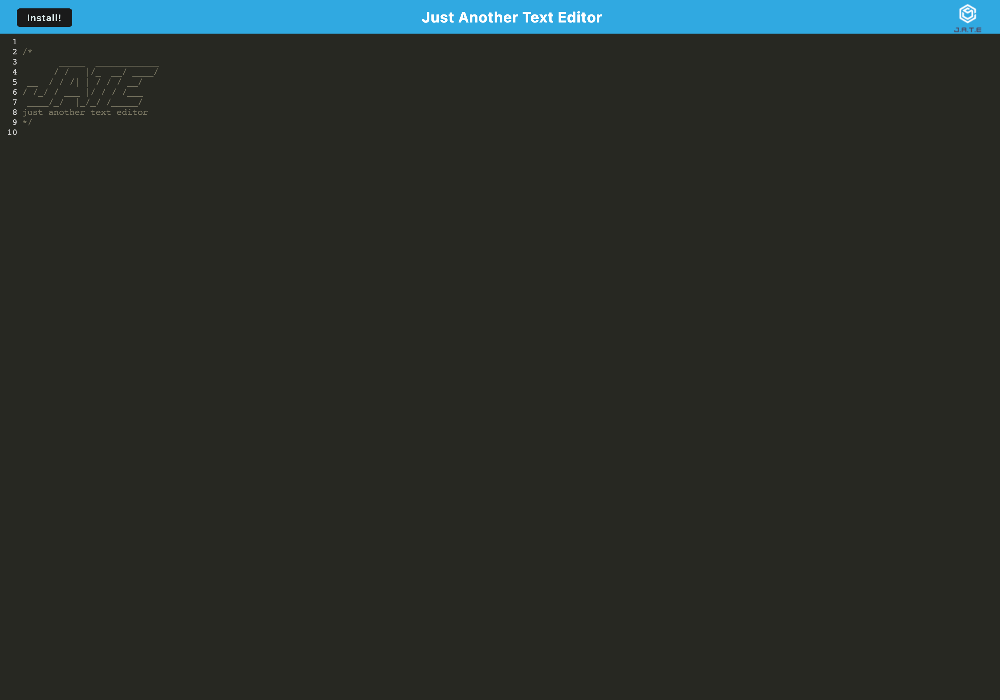

# pwa-text-editor
A single-page application that meets the PWA criteria, features a number of data persistence techniques that serve as redundancy in case one of the options is not supported by the browser, and functions offline.

## Usage and Installation

Please be sure to clone the repository and run `npm install` or `npm i` before trying to open the app in the browser. Once it is open in the browser, you may type directly in the text editor. Click "install" at the top left to use offline. 

Link to the [deployed application](https://tranquil-lowlands-99396-4be35229cb51.herokuapp.com/).

Screenshot of the application:

## Credits

I received starter code for this application from this [GitHub repository](https://github.com/coding-boot-camp/cautious-meme.git). I also received support from a tutor.  

## License

Please refer to the LICENSE in the repo.
